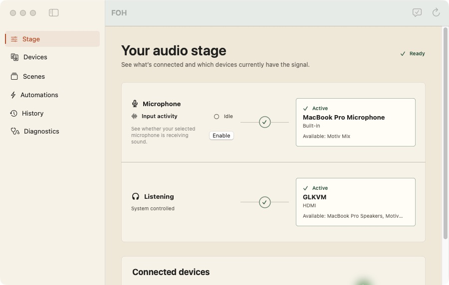
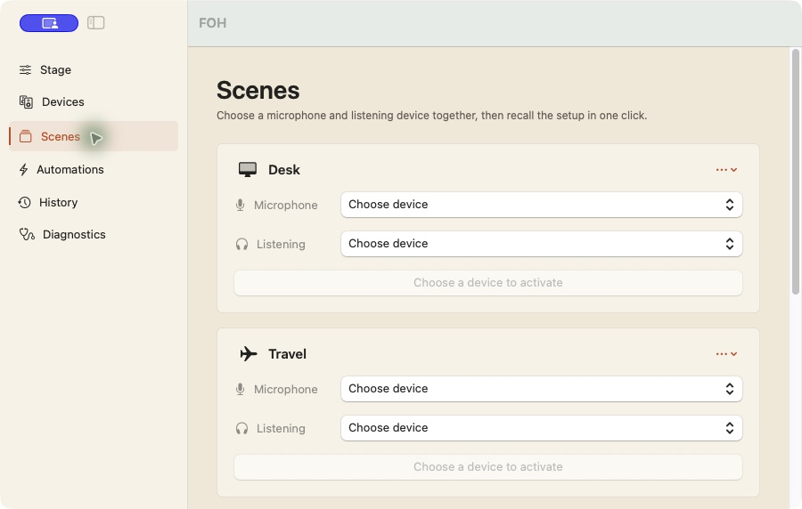
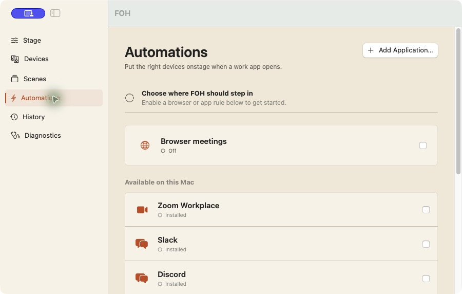
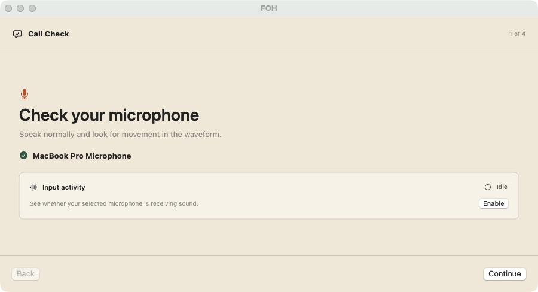

# FOH

FOH keeps your Mac's microphone and audio output pointed at the right devices.
It lives in the menu bar, with a full Mac app when you want to change the setup.

<p align="center">
  
</p>

You join a call. Your USB microphone is missing, macOS quietly chose the MacBook
microphone, and Zoom is still pointing somewhere else. FOH watches which devices
are connected and follows the rules you set. If something changes, it tells you
what it chose and why.

FOH is free and open source. The current build is a release candidate for people
who want to test it on their own audio setup.

## Download

**[Download the latest FOH test build for Mac](https://github.com/rightfast/FOH/releases/latest/download/FOH.dmg)**

The DMG contains one universal app for Apple Silicon and Intel Macs. It requires
macOS 14 or newer.

Open the DMG, then drag FOH into Applications.

### First launch

FOH does not have a Developer ID signature yet. macOS will block the downloaded
test build the first time you open it because Apple cannot verify the developer.

1. Try to open FOH, then dismiss the warning.
2. Open **System Settings > Privacy & Security**.
3. Scroll to **Security** and click **Open Anyway** for FOH.
4. Confirm **Open**.

This adds an exception for FOH. It does not disable Gatekeeper or change the
security policy for other apps. Apple documents this process in
[Open a Mac app from an unknown developer](https://support.apple.com/guide/mac-help/open-a-mac-app-from-an-unknown-developer-mh40616/mac).

The release also includes `FOH.dmg.sha256` so you can verify the download.

## One setup for every desk

Put microphones and listening devices in priority order. Save a pair as a Scene.
Tell FOH what Zoom, Slack, Teams, Discord, Webex, FaceTime, or another Mac app
should use. When a preferred device disappears, FOH can move to the next one and
restore the original when it comes back.

| Scenes | App rules |
| --- | --- |
|  |  |
| Save a microphone and output as one choice. | Choose devices for installed apps or add your own. |

Before a call, Call Check walks through the microphone, output, and active rules.
The optional waveform confirms that the selected microphone is receiving sound.
FOH calculates that level on your Mac and never records the audio.

<p align="center">
  
</p>

## What it can do

- Lists audio inputs and outputs connected to the Mac.
- Lets you order devices by preference.
- Moves to the next available device when one disconnects.
- Restores a preferred device when it reconnects, if you enable that behavior.
- Applies microphone and output choices when a supported app opens.
- Detects meeting pages in the frontmost Safari or Chrome tab.
- Shows live microphone activity without recording audio.
- Records a local history that explains device changes.
- Saves complete microphone-and-output setups as one-click Scenes.
- Walks through microphone, listening, and automation checks before a call.
- Shows exactly which rule is active and why it chose each device.
- Lets you pause all automation or undo its most recent switch.
- Can launch automatically when you sign in to your Mac.

When several rules could apply, FOH uses a predictable order: an active Scene
wins, followed by a browser meeting, a native app rule, and finally ordinary
device priority. The active choice is visible in the app and menu bar.

FOH includes presets for Zoom Workplace, Microsoft Teams, Slack, Cisco Webex,
Discord, and FaceTime. Installed apps appear first. Missing apps stay visible but
disabled, so you can see what FOH supports. You can also add another Mac app with
the application picker.

For app rules, set the microphone and speaker inside the meeting app to
"Same as System." An app-specific device choice can override the macOS default
that FOH manages.

## Browser meetings

The Browser Meetings rule supports Safari and Google Chrome. It checks the
frontmost tab while the rule is enabled. The built-in domains cover Google Meet,
Zoom, Microsoft Teams, and Riverside. You can add your own domains.

FOH processes the active URL in memory and does not save it. macOS asks for
Automation permission the first time FOH needs to inspect a browser. FOH does not
request that permission until you enable Browser Meetings.

## Microphone activity and privacy

The waveform is optional. When enabled, FOH reads microphone levels only while a
FOH interface that shows the meter is visible. It calculates a volume level on the
Mac. It does not record, retain, or transmit audio.

FOH runs inside the macOS App Sandbox. Diagnostic exports omit device names, raw
device identifiers, URLs, and event messages.

## Build and install from source

Building on the Mac where you will use FOH avoids the unknown-developer warning.
You need macOS 14 or newer and Xcode.

1. Install [Xcode from the Mac App Store](https://apps.apple.com/app/xcode/id497799835).
2. Open Xcode once and let it install any required components.
3. Run these commands in Terminal:

```sh
git clone https://github.com/rightfast/FOH.git
cd FOH
./Scripts/install-from-source.sh
```

The script checks macOS and Xcode, builds a Release app, verifies its local code
signature, installs it in `/Applications`, and opens it. If `/Applications` is not
writable, the script uses `~/Applications` and prints the new location.

To update a source installation, quit FOH and run:

```sh
cd FOH
git pull --ff-only
./Scripts/install-from-source.sh
```

## Development

Development requires macOS 14 or newer, Xcode, and
[XcodeGen](https://github.com/yonaskolb/XcodeGen).

```sh
brew install xcodegen
xcodegen generate
xcodebuild -project FOH.xcodeproj -scheme FOH -configuration Debug build
xcodebuild test -project FOH.xcodeproj -scheme FOH -destination 'platform=macOS'
```

The project uses the bundle identifier `studio.rightfast.foh`.

## Releases

GitHub Releases holds numbered test builds and, later, signed public builds.
The test-build workflow runs the unit suite, then builds and verifies a universal
DMG without Apple signing.
Production releases require a paid Apple Developer membership, a Developer ID
Application certificate, and notarization.

See [distribution notes](Docs/DISTRIBUTION.md) for the release commands, GitHub
Actions setup, Homebrew plan, and signing requirements.

## License

FOH is available under the [MIT License](LICENSE).
